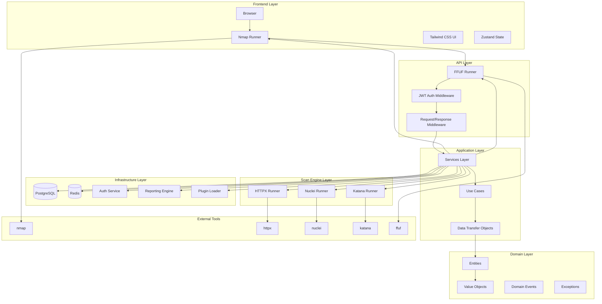
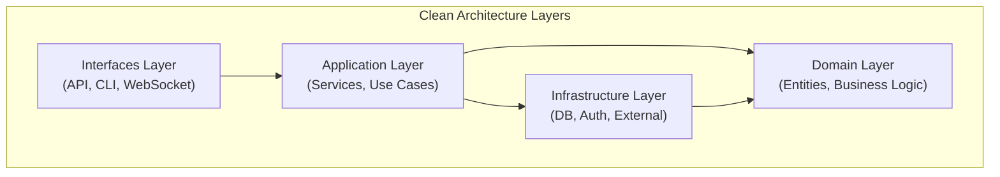
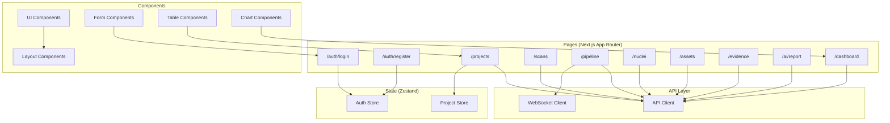
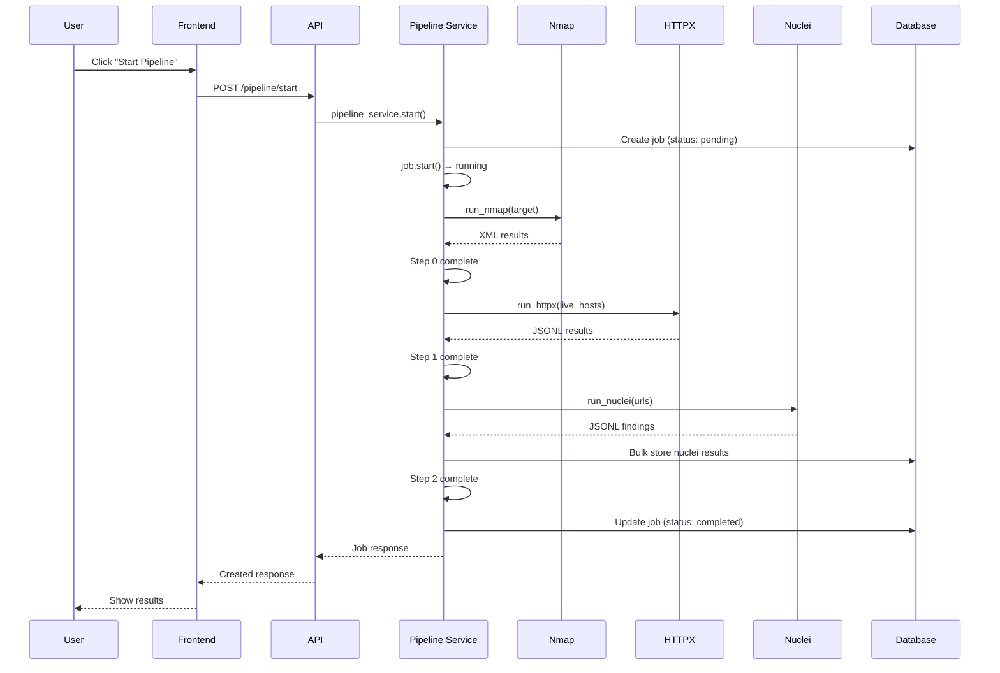
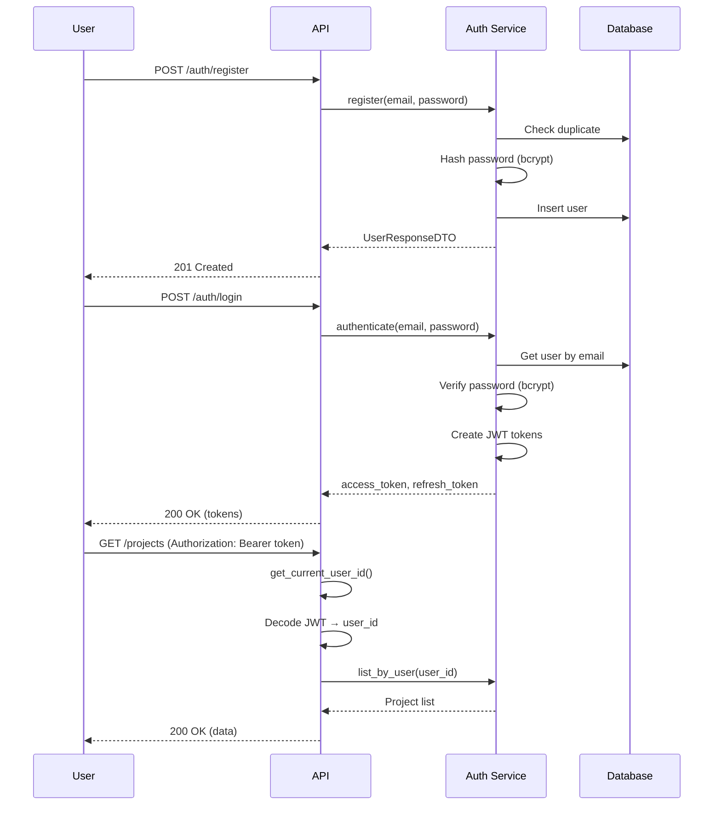
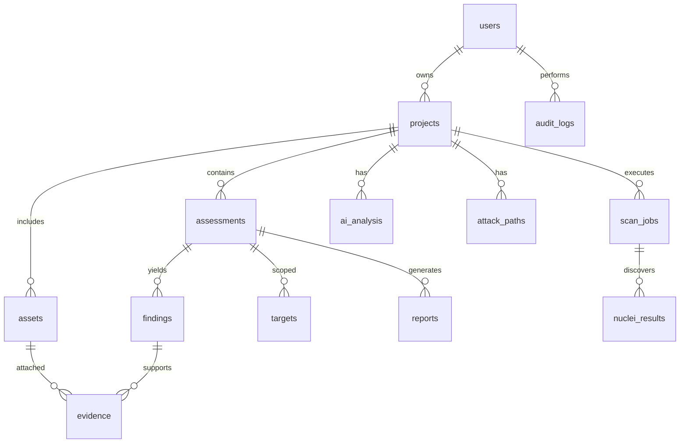
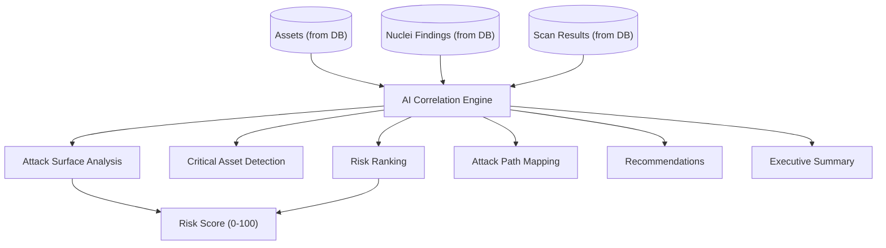

# Architecture

## System Architecture

```mermaid
graph TB
    subgraph "Frontend Layer"
        B[Browser]
        N["Next.js 15 SSR"]
        TW["Tailwind CSS UI"]
        Z["Zustand State"]
    end

    subgraph "API Layer"
        F["FastAPI Server"]
        J["JWT Auth Middleware"]
        MW["Request/Response Middleware"]
    end

    subgraph "Application Layer"
        S["Services Layer"]
        UC["Use Cases"]
        DTO["Data Transfer Objects"]
    end

    subgraph "Domain Layer"
        E["Entities"]
        VO["Value Objects"]
        EV["Domain Events"]
        EX["Exceptions"]
    end

    subgraph "Infrastructure Layer"
        DB[("PostgreSQL")]
        RD[("Redis")]
        A["Auth Service"]
        R["Reporting Engine"]
        P["Plugin Loader"]
    end

    subgraph "Scan Engine Layer"
        N["Nmap Runner"]
        H["HTTPX Runner"]
        NC["Nuclei Runner"]
        K["Katana Runner"]
        F["FFUF Runner"]
    end

    subgraph "External Tools"
        NMAP[nmap]
        HTTX[httpx]
        NCL[nuclei]
        KTN[katana]
        FFUF[ffuf]
    end

    B --> N
    N --> F
    F --> J
    J --> MW
    MW --> S
    S --> UC
    UC --> DTO
    DTO --> E
    E --> VO
    S --> DB
    S --> RD
    S --> A
    S --> R
    S --> P
    S --> N & H & NC & K & F
    N --> NMAP
    H --> HTTX
    NC --> NCL
    K --> KTN
    F --> FFUF
```

## Backend Architecture

```mermaid
graph LR
    subgraph "Clean Architecture Layers"
        direction LR
        I["Interfaces Layer<br/>(API, CLI, WebSocket)"]
        A["Application Layer<br/>(Services, Use Cases)"]
        D["Domain Layer<br/>(Entities, Business Logic)"]
        IF["Infrastructure Layer<br/>(DB, Auth, External)"]
    end

    I --> A
    A --> D
    A --> IF
    IF --> D
```

## Frontend Architecture

```mermaid
graph TB
    subgraph "Pages (Next.js App Router)"
        LOGIN["/auth/login"]
        REG["/auth/register"]
        PROJ["/projects"]
        SCAN["/scans"]
        PIPE["/pipeline"]
        NUC["/nuclei"]
        ASSET["/assets"]
        EVID["/evidence"]
        AI["/ai/report"]
        DASH["/dashboard"]
    end

    subgraph "Components"
        UI["UI Components"]
        FORM["Form Components"]
        TABLE["Table Components"]
        CHART["Chart Components"]
        LAYOUT["Layout Components"]
    end

    subgraph "State (Zustand)"
        AUTH["Auth Store"]
        PROJ_STORE["Project Store"]
    end

    subgraph "API Layer"
        CLIENT["API Client"]
        WS["WebSocket Client"]
    end

    LOGIN --> AUTH
    REG --> AUTH
    PROJ --> PROJ_STORE
    PROJ --> CLIENT
    SCAN --> CLIENT
    PIPE --> WS
    PIPE --> CLIENT
    NUC --> CLIENT
    ASSET --> CLIENT
    EVID --> CLIENT
    AI --> CLIENT
    DASH --> CLIENT
    UI --> LAYOUT
    FORM --> LOGIN
    TABLE --> PROJ
    CHART --> DASH
```

## Pipeline Flow

```mermaid
sequenceDiagram
    participant U as User
    participant F as Frontend
    participant API as API
    participant P as Pipeline Service
    participant N as Nmap
    participant H as HTTPX
    participant NC as Nuclei
    participant DB as Database

    U->>F: Click "Start Pipeline"
    F->>API: POST /pipeline/start
    API->>P: pipeline_service.start()
    P->>DB: Create job (status: pending)
    P->>P: job.start() → running
    P->>N: run_nmap(target)
    N-->>P: XML results
    P->>P: Step 0 complete
    P->>H: run_httpx(live_hosts)
    H-->>P: JSONL results
    P->>P: Step 1 complete
    P->>NC: run_nuclei(urls)
    NC-->>P: JSONL findings
    P->>DB: Bulk store nuclei results
    P->>P: Step 2 complete
    P->>DB: Update job (status: completed)
    P-->>API: Job response
    API-->>F: Created response
    F-->>U: Show results
```

## Authentication Flow

```mermaid
sequenceDiagram
    participant U as User
    participant API as API
    participant A as Auth Service
    participant DB as Database

    U->>API: POST /auth/register
    API->>A: register(email, password)
    A->>DB: Check duplicate
    A->>A: Hash password (bcrypt)
    A->>DB: Insert user
    A-->>API: UserResponseDTO
    API-->>U: 201 Created

    U->>API: POST /auth/login
    API->>A: authenticate(email, password)
    A->>DB: Get user by email
    A->>A: Verify password (bcrypt)
    A->>A: Create JWT tokens
    A-->>API: access_token, refresh_token
    API-->>U: 200 OK (tokens)

    U->>API: GET /projects (Authorization: Bearer token)
    API->>API: get_current_user_id()
    API->>API: Decode JWT → user_id
    API->>A: list_by_user(user_id)
    A-->>API: Project list
    API-->>U: 200 OK (data)
```

## Database Relations

```mermaid
erDiagram
    users ||--o{ projects : owns
    users ||--o{ audit_logs : performs
    projects ||--o{ assessments : contains
    projects ||--o{ assets : includes
    projects ||--o{ scan_jobs : executes
    projects ||--o{ ai_analysis : has
    projects ||--o{ attack_paths : has
    assessments ||--o{ findings : yields
    assessments ||--o{ targets : scoped
    assessments ||--o{ reports : generates
    assets ||--o{ evidence : attached
    scan_jobs ||--o{ nuclei_results : discovers
    findings ||--o{ evidence : supports
```

## AI Correlation Flow

```mermaid
graph TB
    ASSETS[("Assets (from DB)")]
    NUCLEI[("Nuclei Findings (from DB)")]
    SCANS[("Scan Results (from DB)")]

    CORR["AI Correlation Engine"]

    SURF["Attack Surface Analysis"]
    CRIT["Critical Asset Detection"]
    RISK["Risk Ranking"]
    PATHS["Attack Path Mapping"]
    RECS["Recommendations"]
    SUM["Executive Summary"]

    ASSETS --> CORR
    NUCLEI --> CORR
    SCANS --> CORR

    CORR --> SURF
    CORR --> CRIT
    CORR --> RISK
    CORR --> PATHS
    CORR --> RECS
    CORR --> SUM

    SURF --> SCORE["Risk Score (0-100)"]
    RISK --> SCORE
```
